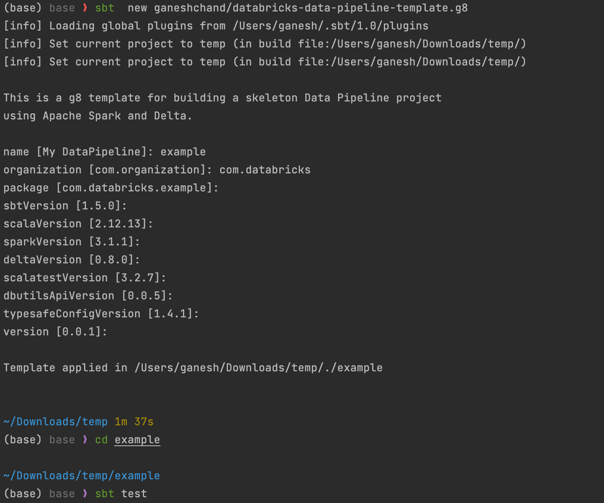
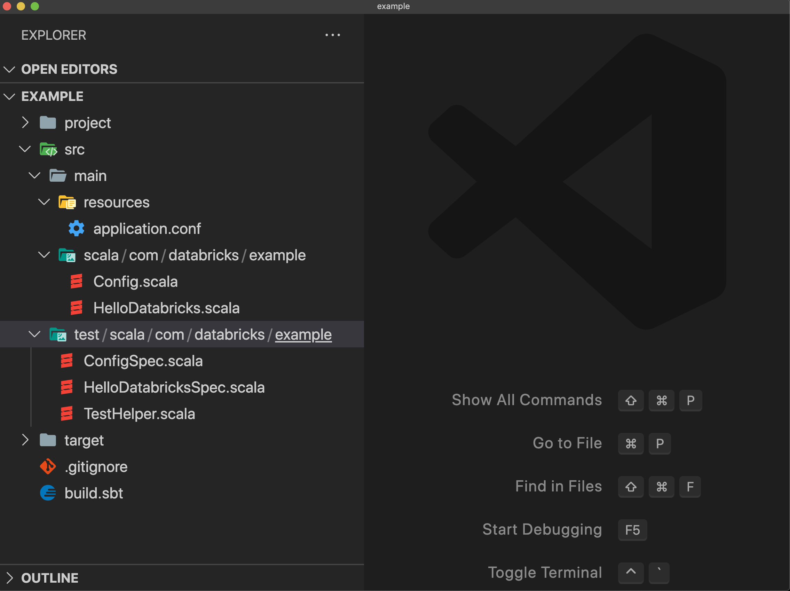

# databricks-data-pipeline-template.g8 

## A [Databricks][databricks] Data Pipeline project template using [Giter8][g8]

This is a Scala SBT project template intended to fast track data engineers in developing data pipelines using [Apache Spark][spark] and [Delta][delta] on the Databricks platform by providing a working Scala SBT project with the necessary dependencies.

[g8]: http://www.foundweekends.org/giter8/
[sbt]: https://www.scala-sbt.org
[Scala]: https://wwww.scala-lang.org
[Apache Spark]: https://spark.apache.org/
[Delta Lake]: https://delta.io/
[Databricks]: https://databricks.com/
[install SBT]: https://www.scala-sbt.org/1.x/docs/Setup.html

## What does this template provide?

* An SBT Scala project with the following dependencies:

    * `spark-sql` for developing your ETL pipeline
    * `delta-core` for creating Delta Table
    * `dbutils-api` for accessing [Databricks Utilities](https://docs.databricks.com/dev-tools/databricks-utils.html#databricks-utilities)
    * `scalatest` for unit test
    * `scribe` for logging

* It also provides `sbt-assembly` sbt plugin in case you need to build an uber jar.

## Getting started

### Using template
1. [Install SBT](installSBT) in case you don't have it installed on your local machine
2. create a project using the template 
```bash
$ sbt new ganeshchand/databricks-data-pipeline-template.g8
```
   Note: you will be prompted to either provide parameter values or simply accept the defaults.
   Alternatively, you can simply provide the parameter values you wish to customize as shown below:
   ```
   $ sbt new ganeshchand/databricks-data-pipeline-template.g8 --name=example --organization=com.databricks
   ```

3. `$ cd <YOUR_PROJECT_NAME>`
4. Run test `$ sbt test`. The first test will take about a minute or less depending on your internet speed because it will download the project dependencies jars from maven
   
5. Open your project in IDE:
    * IntelliJ: `$ idea .`
     * VS CODE: `$ code .`
      
6. If you are a Databricks customer, you can create a Workflow using the jar. Following the instructions [here](https://docs.databricks.com/jobs.html#create-a-job)
   To create a jar, run the following command:
   ```bash
    $ sbt package 
    ```
For reference, below is a JSON representation of a Databricks Workflow with a Jar task
```json
{
  "name": "scala-sbt-template-test",
  "tasks": [
    {
      "task_key": "app",
      "spark_jar_task": {
        "jar_uri": "",
        "main_class_name": "com.examples.databricks.PipelineMain",
        "parameters": ["dev"]
      },
      "job_cluster_key": "job_cluster",
      "libraries": [
        {
          "jar": "dbfs:/gc/jars/root_2.12-0.0.1.jar"
        }
      ],
  ],
  "job_clusters": [
    {
      "job_cluster_key": "job_cluster",
      "new_cluster": {
        "spark_version": "14.3.x-scala2.12",
        "node_type_id": "m5d.large",
        "driver_node_type_id": "m5d.large",
        "data_security_mode": "SINGLE_USER",
        "runtime_engine": "STANDARD",
        "num_workers": 1
      }
  ]
}
```
### Scala Version
Scala 2.13 support was added Starting Apache Spark 3.2.0. However, Databricks only supports Scala 2.12. 
Template default is scala 2.12
If you wish to to create template with Scala 2.13 version, you can use scala213 branch.  
```bash
$ sbt new ganeshchand/databricks-data-pipeline-template.g8 -b scala213
```

### Contributing to this template
1. Fork this repo and clone it on your local machine
2. Make changes to the template and make sure to clean the previous build `sbt clean compile`
3. Test the template on your local machine
  *  `sbt new file://databricks-data-pipeline-template.g8 --name=test --organization=com.example`
  * `cd template-test`
  * `sbt test`
4. Send the pull request

Note: If you need to use the absolute local path, you'll need to use `file://<absolute_path>`
```bash
$ sbt new file:///temp/databricks-data-pipeline-template.g8 --name=test --organization=com.example
```